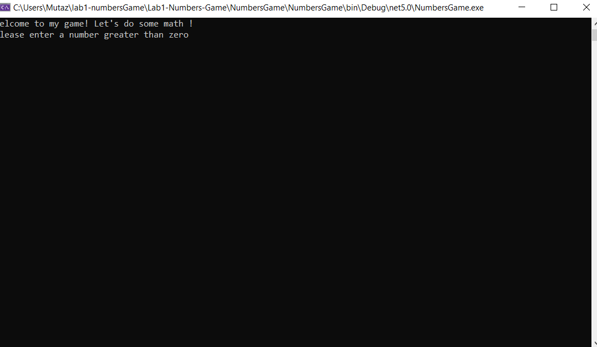
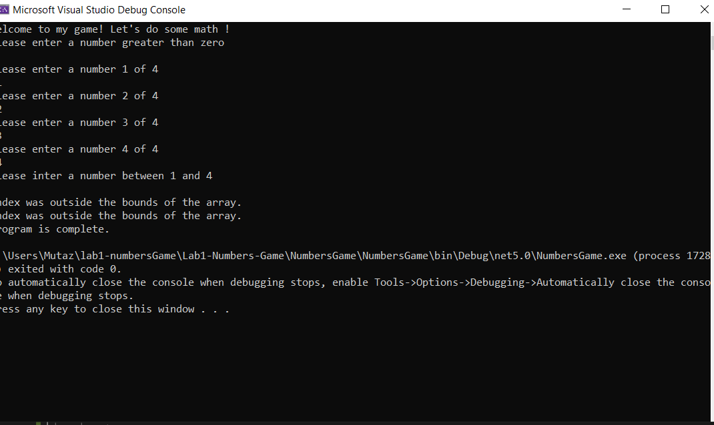
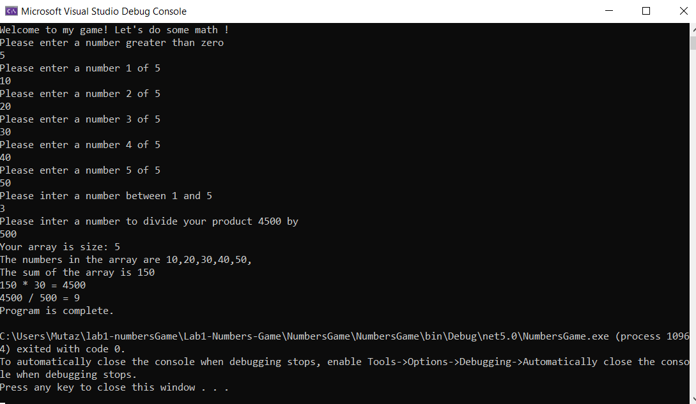

# Lab1-Numbers-Game 

# Description

This program will prompt a user to enter several numbers and then will perform several math operations with those numbers.
In the end of this program the user will see a list of results of all their math operations.

---

# Run program
You can run the program by clone the repository of it to your local machine.

**$ git clone [repo url]**

### Then you can open the program in your visual studio:
Select File -> Open -> Project/Solution

Next navigate to the location where you cloned the repository.

Double-click on the Lab01-Numbers-Game directory.

Then select and open Lab01-Numbers-Game.sln

---

# Visual
**Program will look like :**

---

**Exceptions**

---

**results**

